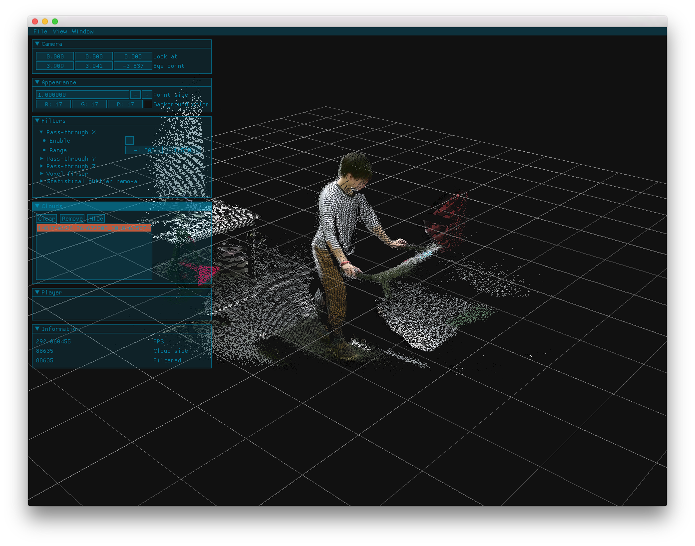

# CiPointCloudViewer


## Setup
### Directory structure (example)

```
src
└── github.com
    ├── cinder
    │  └── Cinder
    └── izumin5210
       └── CiPointCloudViewer
```

### Download project and dependencies
#### cinder/Cinder

```
$ git clone https://github.com/cinder/Cinder.git ~/src/github.com/cinder/Cinder

$ cd ~/src/github.com/cinder/Cinder

$ git submodule init && git submodule update
```

#### izumin5210/CiPointCloudViewer

```
$ git clone https://github.com/izumin5210/CiPointCloudViewer.git ~/src/github.com/izumin5210/CiPointCloudViewer

$ cd ~/src/github.com/izumin5210/CiPointCloudViewer

$ git submodule init && git submodule update

$ cd blocks/ImGui/lib

$ git submodule init && git submodule update
```

### Build on Linux
TBD

### Build on Mac OSX/macOS
TBD

## LICENSE
Licensed under [MIT License](https://izumin.mit-license.org/2016).
